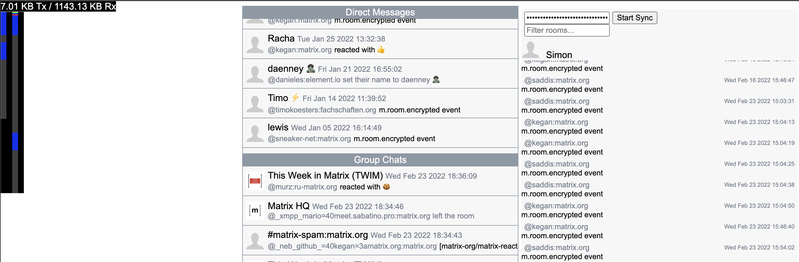

## Sliding Sync Client

This is a basic JS client for Sliding Sync. It is designed to be easily readable and is aimed at
developers who want to implement Sliding Sync into their clients. The client is broken up into:

-   `devtools.js` : Code for showing developer statistics.
-   `index.js` : Entry point for the client and hooks into the DOM.
-   `render.js` : Code to convert data structures into DOM nodes.
-   `sync.js` : Sliding Sync code.

To understand sliding sync, you need to read `index.js` and `sync.js`. The rest of it can be ignored.

The client code uses Prettier as a code formatter.
